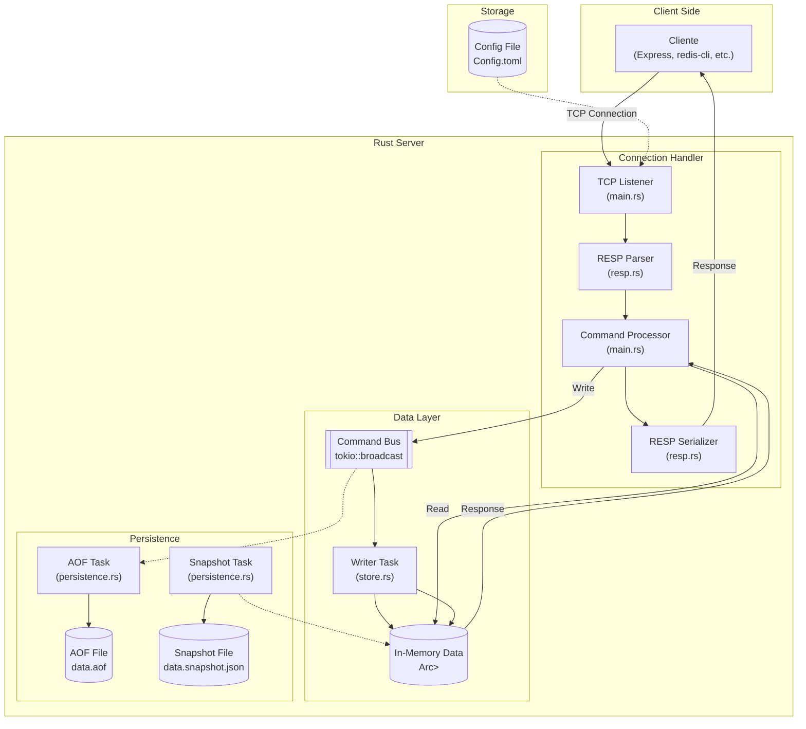

<p align="center">
  
</p>

# Altilium-DB: Um Banco de Dados Key-Value em Rust

Altilium-DB é um banco de dados em memória do tipo chave-valor, construído do **zero** em Rust. Ele foi projetado para ser leve, performático e compatível com o protocolo RESP, o que permite que qualquer cliente Redis se comunique com ele.

### Características 
✅ **Rápido e leve:** Executa localmente sem consumir recursos excessivos.

✅ **Compatível com comandos Redis-like:** Fácil migração para testes.

✅ **Persistência opcional:** Salva dados em disco quando necessário.

✅ **Open Source:** Decidimos compartilhar para ajudar outras equipes a evitar as mesmas dores que tivemos.

Depois de enfrentar alguns erros em teste locais, percebi que precisávamos de uma solução leve e poderosa. Foi assim que nasceu o Altilium DB, um banco de dados **inspirado** no Redis, mas otimizado para ambientes específicos, focado em simplicidade e desempenho.


## ✨ Funcionalidades



* **Compatibilidade com o Protocolo Redis (RESP):** Permite o uso de clientes Redis existentes em diversas linguagens (Node.js, Python, etc.).
* **Comandos Suportados:** Implementa um subconjunto dos comandos mais comuns do Redis: `GET`, `SET`, `HSET`, `DEL`, `KEYS`, `PING` e `AUTH`.
* **Persistência de Dados Híbrida:**
    * **Snapshotting:** Salva periodicamente todo o estado do banco em um arquivo JSON.
    * **Append-Only File (AOF):** Registra todos os comandos de escrita em um arquivo, garantindo maior durabilidade.
* **Autenticação:** Suporta autenticação por senha via comando `AUTH`.
* **Expiração de Chaves:** Permite definir um tempo de vida para as chaves (usando `PX` e `EX` no comando `SET`).
* **Configuração Externa:** As configurações de rede e senha são gerenciadas através de um arquivo `Config.toml`.

## ⚙️ Arquitetura e Lógica de Funcionamento

O banco de dados é construído sobre a plataforma assíncrona do Rust, o **Tokio**, e é dividido em vários módulos, cada um com uma responsabilidade clara.

### 1. `main.rs`: O Ponto de Entrada

É o coração do servidor. Suas principais responsabilidades são:
-   **Carregar Configurações:** Lê o arquivo `Config.toml` para obter host, porta e senha.
-   **Inicializar Componentes:** Cria as instâncias do `Store` (armazenamento) e do `PersistenceManager`.
-   **Gerenciar Tarefas (Tasks):** Utiliza o `tokio::spawn` para iniciar tarefas de longa duração que rodam em background e de forma concorrente:
    - A task principal do `Store` para processar comandos de escrita.
    - A task do `PersistenceManager` para criar snapshots periódicos.
    - A task do `PersistenceManager` para persistência AOF.
    - A task de limpeza para remover chaves expiradas.
-   **Escutar Conexões TCP:** Abre um `TcpListener` na porta configurada e, para cada nova conexão, gera uma nova task para gerenciá-la (`handle_connection`).

### 2. `store.rs`: O Armazenamento Central de Dados

Este módulo gerencia o estado do banco de dados de forma segura entre múltiplas threads.
-   **Estrutura de Dados:** Usa um `Arc<RwLock<HashMap<String, Value>>>` para armazenar os dados.
    -   `Arc` (Atomically Reference Counted) permite que múltiplos donos acessem os dados de forma segura.
    -   `RwLock` (Read-Write Lock) permite múltiplas leituras concorrentes ou uma única escrita exclusiva, garantindo a consistência dos dados.
-   **Padrão "Command Bus":** Para evitar locks de escrita prolongados e complexos, o `Store` utiliza um canal de `broadcast` do Tokio (`tokio::sync::broadcast`).
    1.  Quando um comando de escrita (`SET`, `HSET`, `DEL`) é recebido em `handle_connection`, ele não modifica o estado diretamente.
    2.  Em vez disso, ele envia o comando para o canal de broadcast.
    3.  Uma única task de background (`process_commands`) escuta esse canal, recebe os comandos em ordem e os aplica ao `HashMap` principal. Isso centraliza todas as operações de escrita em uma única fila, simplificando a concorrência.

### 3. `persistence.rs`: A Persistência de Dados

Garante que os dados não sejam perdidos quando o servidor é reiniciado.
-   **Snapshotting (`create_snapshot`):**
    -   Periodicamente, uma task obtém um lock de leitura no `Store`.
    -   Clona todo o `HashMap` de dados.
    -   Serializa os dados para o formato JSON.
    -   Para garantir atomicidade, ele primeiro escreve em um arquivo temporário (`.tmp`). Se a escrita for bem-sucedida, ele renomeia o arquivo para o nome final (`data.snapshot.json`), evitando corrupção.
-   **Append-Only File (AOF) (`run_aof_persistence`):**
    -   Uma task se inscreve no mesmo canal de `broadcast` de comandos do `Store`.
    -   Toda vez que um comando de escrita é recebido, ele é convertido para o formato RESP (`command_to_resp`) e anexado ao final do arquivo `data.aof`.
    -   Isso oferece uma durabilidade maior que o snapshotting, pois cada operação é salva imediatamente.
-   **Carregamento (`load_from_disk`):** Na inicialização, o servidor primeiro tenta carregar o snapshot mais recente para restaurar o estado principal. A recuperação a partir do AOF pode ser implementada para "reproduzir" os comandos ocorridos após o último snapshot.

### 4. `resp.rs`: O Parser do Protocolo

Este módulo é a interface entre os bytes da rede e as estruturas de dados do Rust.
-   **Parsing (`parse_resp`):** Utiliza a biblioteca `nom` para criar um parser de "parser combinators". Ele lê o fluxo de bytes de entrada e o transforma em uma enum `RespValue`, que representa os tipos de dados do protocolo (SimpleString, BulkString, Array, etc.).
-   **Serialização (`serialize_resp`):** Faz o processo inverso. Pega uma enum `RespValue` (a resposta de um comando) e a converte de volta em uma sequência de bytes no formato RESP, pronta para ser enviada pela rede.

### 5. `connection.rs` e `handle_connection`

A lógica de `handle_connection` em `main.rs` gerencia o ciclo de vida de uma única conexão de cliente.
-   **Loop de Leitura-Análise:**
    1.  Lê dados do socket TCP para um buffer.
    2.  Entra em um loop para tentar analisar um comando completo do buffer usando `parse_resp`.
    3.  Se um comando é analisado com sucesso, ele é passado para `process_command`.
    4.  A resposta retornada por `process_command` é serializada por `serialize_resp` e enviada de volta ao cliente.
    5.  O loop continua para o caso de o cliente ter enviado múltiplos comandos de uma vez (pipelining). Se o buffer estiver com dados parciais, o loop é interrompido para aguardar mais dados do socket.

## 🚀 Como Executar

1.  **Pré-requisitos:**
    -   Instale a toolchain do [Rust](https://www.rust-lang.org/tools/install).

2.  **Configuração:**
    -   Copie ou renomeie `Config.toml.example` para `Config.toml`.
    -   Ajuste `host`, `port` e `requirepass` conforme necessário.

3.  **Compilar e Executar:**
    ```bash
    # Compila o projeto em modo de release (otimizado)
    cargo build --release

    # Executa o binário gerado
    ./target/release/altilium_server
    ```
    O servidor será iniciado e começará a escutar conexões.

## 🔌 Como Conectar

```mermaid
graph LR
    %% Elementos principais
    Usuario[Usuário]
    CLI["CLI Altilium\n(redis-cli like)"]
    App["Aplicação\n(Driver oficial)"]
    Servidor["Servidor AltiliumDB"]
    Dados[("Seus Dados")]

    %% Fluxo simplificado
    Usuario -->|Comandos| CLI
    Usuario -->|Integração| App
    CLI -->|TCP/IP| Servidor
    App -->|TCP/IP| Servidor
    Servidor -->|Persiste| Dados

    %% Estilização
    style Usuario fill:#000,stroke:#fff
    style CLI fill:#7af,stroke:#333
    style App fill:#7af,stroke:#333
    style Servidor fill:#2ecc71,stroke:#333
```



Você pode usar qualquer cliente Redis. O `redis-cli` é o mais comum para testes:

```bash
# Conecte ao servidor usando a porta e a senha do seu Config.toml
redis-cli -p 6379 -a "123456"

# -- Comandos de Exemplo --

# Autenticar (se você não usou -a)
> AUTH 123456
OK

# Ping para testar a conexão
> PING
PONG

# Salvar uma chave
> SET nome "Alice"
OK

# Buscar uma chave
> GET nome
"Alice"

# Usar um hashmap
> HSET usuario:1 nome "Bob"
(integer) 1

> HSET usuario:1 email "bob@example.com"
(integer) 1
```
---
## Test-Client.py: Seu Companheiro para Testar o Altilium DB Localmente
### O que ele faz?
É um client Pyhton minimalista que:
- Conecta no seu Altilium DB local ```(127.0.0.1:6379)```
- Manda comandos tipo Redis ```(SET, GET, DEL, VIEW)```
- Tem um modo interativo (pra você testar sem recompilar 50x)

### Como usar?

### 1. Garanta que o Altilium DB tá rodando:
```bash
cargo run --release
```
### 2. Rode o client:
```bash
python3 test-client.py 
```
### 3. Teste:
```bash
> SET nome Altilium  
OK  
> GET nome  
"Altilium"  
> DEL nome  
1  
> VIEW  
(Banco vazio)  
```
---
## Mas isso é um Redis?"
❌ Não (e nem quer ser)

✅ Mas é um baita ajudante pra desenvolvimento.

### O que ele NÃO faz?
- Substituir Redis em produção (nem tente, sério)

- Lidar com 1M de requests por segundo

### Por que abrimos o código?
Porque:

Já nos salvou de várias enrascadas

Se ajudou a gente, pode ajudar outros devs.


